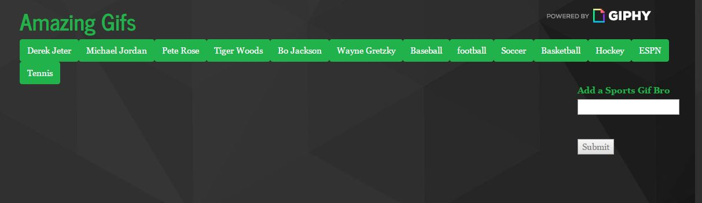
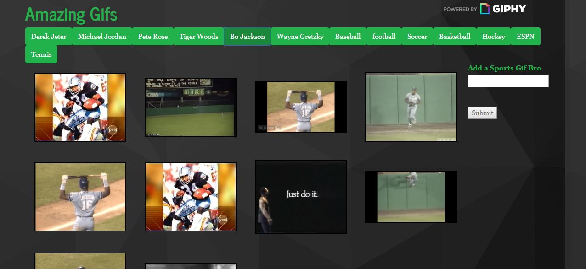
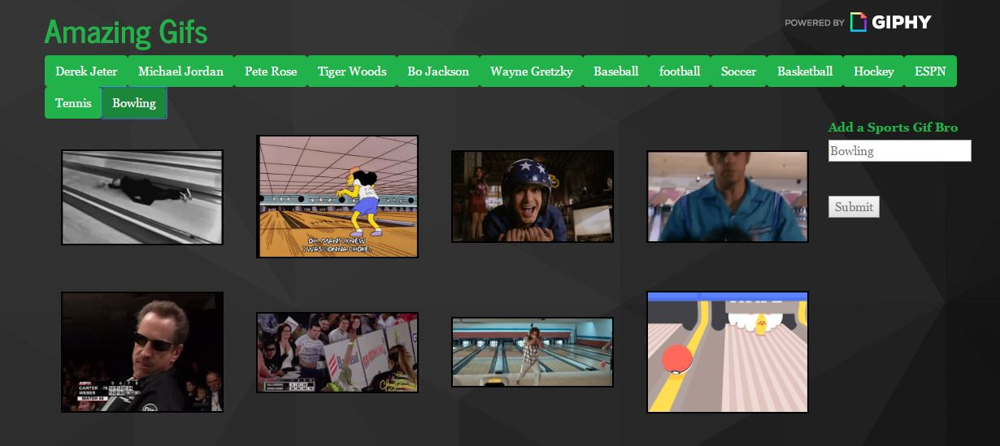

# SportsGiphyApp

Link to the Sports Giphy App : [link](https://sportsgifapp.herokuapp.com/)

***

#### An array of sports and made buttons out of them. When you click on a button, you get 10 images from giphy and put them on the page. A search area allows you to type anything in sports related, and the button will be created to show the giphy.

***

## Basic Functionality:
* Used HTML and CSS for designing the application home page. 
* Used Javascript for making AJAX calls with jQuery to the Giphy API using the function `displayGif()`.
* Buttons are dynamically created with jQuery in the function `renderButtons()`.

***

## Screenshots of the app functions

### Here shows what appears when app is first loaded. 

### When you click on a button(in this instance, we clicked "Bo Jackson") and 10 giphys appear.

### After typing in a sports genre/person (here we typed "Bowling") a new button is added and clickable.

